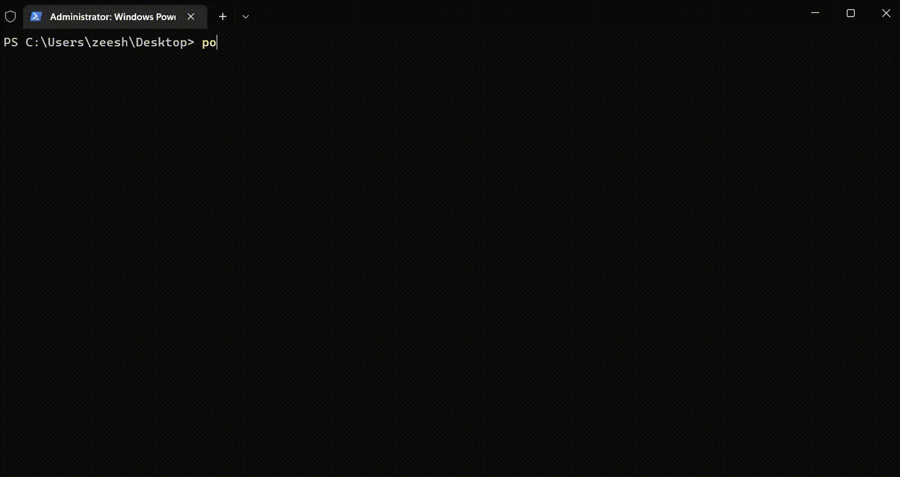

# Check-Permissions
 Check File/Folder permissions using PowerShell
 
 Use:
 
    powershell -ep bypass .\CheckPermissions.ps1 -Path C:\ProgramData -User Everyone
 
 Default Path - 
 
     C:\ProgramData
 Default Users/Group - 
 
     Everyone
     
     Guest
     
     BUILTIN\Users
     
     NT AUTHORITY\Authenticated Users
     

Add -inherit for inherited values default is off.

    powershell -ep bypass .\CheckPermissions.ps1 -Path C:\ProgramData -User Everyone
 
 For path or user with spaces use escape character (\`). Make sure to use single quotes.
 
    powershell -ep bypass .\CheckPermissions.ps1 -Path C:\Windows\Temp -User 'NT\` Authority\Authenticated\` Users'
    

 
 
